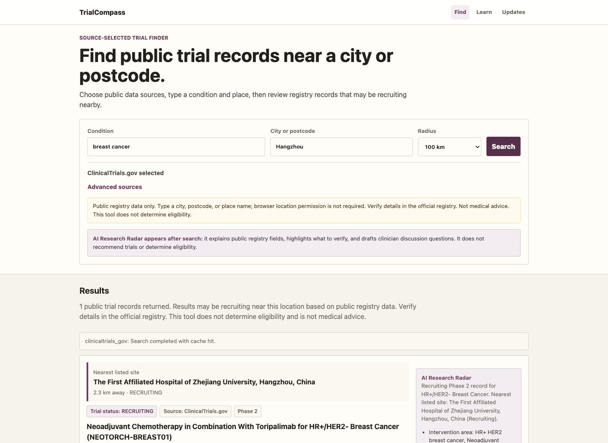
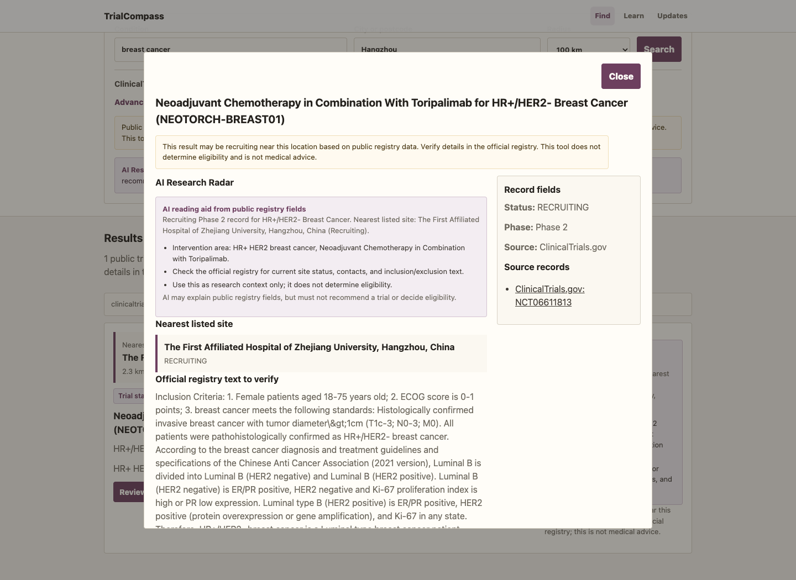

# TrialCompass: AI Clinical Trial Finder for Patients

TrialCompass is an open-source, AI-driven clinical trial search engine for patients, caregivers, NGOs, and patient advocacy groups.

The goal is simple: patients should be able to search public clinical trial registries by condition and location, understand what the registry record says, and prepare better questions for a licensed clinician.

This project is not a medical decision tool. It does not recommend treatments, rank trials, decide eligibility, interpret personal medical records, collect patient health data, or store patient location profiles.


Suggested GitHub repository name:

```text
ai-clinical-trial-finder
```

Suggested GitHub description:

```text
Open-source AI-driven clinical trial finder for patients using public registry data.
```

Suggested GitHub topics:

```text
clinical-trials, clinicaltrials-gov, trial-finder, patient-tools, healthcare-ai, public-health, fastapi, medical-research, registry-data
```

## Why This Exists

Clinical trial information is public, but it is still hard for patients to use. Records are spread across registries, written in technical language, and often difficult to filter by nearby recruiting sites.

This project aims to give patients their own AI-driven search layer over public registry data:

- choose official data sources
- search by disease and city/postcode
- see nearby trial sites and public recruiting status
- open the official registry record for verification
- read plain-language research context
- collect questions to discuss with a clinician

## Screenshots

### Trial Finder



### AI Research Radar



## Current MVP

- Connected source: ClinicalTrials.gov
- Planned or catalog-only sources: ANZCTR, WHO ICTRP, EU CTIS, and selected national registries
- Search inputs: condition, city/postcode, radius, source selection
- Result fields: nearest listed site, distance, site status, trial status, phase, source, official registry link
- AI Research Radar: public-registry reading aid, research context, verification prompts, and clinician discussion questions

ClinicalTrials.gov does not require an API key.

## Technical Architecture

- Source-grounded AI engine with prompt contracts and safety rules.
- FastAPI backend for on-demand trial search.
- Source connector layer for registry-specific APIs.
- Normalized trial model with source records, site status, geo points, contacts, and official registry links.
- Dedicated AI reading endpoint for trial-level explanations.
- Query-time distance sorting from typed city/postcode; no browser location permission is required.
- Hash-based runtime cache that avoids storing raw user location history.
- Local deterministic AI reading fallback so no provider key is needed in the browser.
- Generated disease radars and bulk static pages are treated as build artifacts, not core source code.

## Safety Boundaries

The tool may:

- summarize public registry records
- explain research terms
- normalize public trial fields
- show public site/contact/status information
- generate questions to discuss with a clinician

The tool must not:

- recommend a trial
- decide whether someone is eligible
- rank treatments by safety or effectiveness
- interpret personal health data
- store patient health profiles or location history
- sell patient leads

## Quick Start

```bash
python3 -m pip install -r requirements.txt
python3 -m unittest discover -s tests -v
python3 -m trial_finder
```

Then open:

```text
http://127.0.0.1:8000/finder.html
```

Example search:

```text
condition: breast cancer
location: Hangzhou
radius: 100 km
source: ClinicalTrials.gov
```

## API Keys and Privacy

The finder can run with ClinicalTrials.gov without any API key.

Optional AI enrichment scripts can use provider keys through environment variables such as `OPENAI_API_KEY` or `DEEPSEEK_API_KEY`. Do not commit `.env` files and do not put model provider keys in browser JavaScript.

Runtime cache files are written under `.trial-finder-cache/`, which is ignored by git. Cache metadata stores query hashes rather than raw user location text.

See [SECURITY.md](SECURITY.md) and [docs/PUBLISHING.md](docs/PUBLISHING.md) before publishing or deploying.

## Project Structure

- `trial_finder/`: FastAPI runtime finder and source connectors
- `trial_finder/ai_engine.py`: source-grounded AI reading contract and local fallback
- `site/`: static web pages
- `scripts/`: data normalization, radar generation, optional AI workflows
- `configs/`: disease/source configuration
- `tests/`: unit and integration tests
- `docs/`: product, safety, and publishing notes

Generated registry snapshots, AI cache files, reports, and bulk static trial pages are intentionally not committed. They can be regenerated locally from public sources when needed.

## Contributing

Contributions are welcome. Useful areas include:

- adding validated registry connectors
- improving disease aliases and location handling
- improving patient-friendly explanations
- strengthening safety copy and non-recommendation boundaries
- improving UI/UX for patients and caregivers
- adding tests for source normalization, deduplication, and privacy behavior

Please keep the project patient-friendly, source-grounded, and public-data only.

## Deployment Notes

GitHub Pages can host the static `site/` pages.

The dynamic trial finder uses a FastAPI backend, so `/api/search` needs a backend host such as Render, Fly.io, Railway, a VM, or another server environment.

Never expose AI provider keys in frontend code.

## License

MIT License. See [LICENSE](LICENSE).
